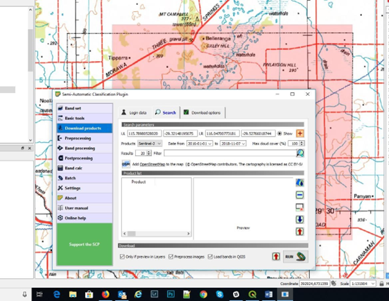

==============================================
Using the Semi Automatic Classification Plugin
==============================================

Selection, downloading and processing of satellite remote sensing data can be achieved using the Semi Automatic Classification Plugin (SCP) written by `Luca Congedo <https://fromgistors.blogspot.com/p/semi-automatic-classification-plugin.html>`. After installing the plugin you can open the plugin via the main menu bar. Note the plugin automatically adds panels and toolbars which I normally close to free up window space.

Note that version 8 does not currently do atmospheric corrections on ASTER and Sentinel 2 data and if this is something required, then install vesion 7 - see FAQ on the SCP web site here https://semiautomaticclassificationmanual.readthedocs.io/en/latest/.

The following notes apply to the Semi-Automatic Classification plug-in version 7. Updates notes for version 8 to follow.

The main SCP window shows tabs for downloading data, as well as a variety of other pre and post processing options, band calculations and tools for land cover classification.

To download data you need to register with the USGS via their `EarthExplorer portal <http://earthexplorer.usgs.gov/>`_ (free registration) for ASTER and Landsat data and with the European Space Agency (ESA) via their `Sentinel data access portal <https://scihub.copernicus.eu/dhus/#/home>`_. Enter these login details into the relevant sections of the SCP Download Products > Login data tab.

Note that recent changes to the USGS portal has required users to also register and login to the USGS EarthData portal before downloading data.

.. note:: Make sure you click “Remember” so you don't have to re-enter your login details each time. Logins with ESA may take a couple of days to initialise.

Once all the logins are complete, then you are ready to download data. Have the area that you wish to obtain data displayed in your QGIS map window as we will create a search area directly into this window. Click on the Search tab of the Download Products window.

The required product can be selected via the “Products” dropdown list. To select a search area, click on the orange-red cross in the top RHS of the window, then left click the top left hand side of the map area, then right click on the lower right hand side to set your search area. This will then populate the search area parameters.

You can further refine your data search by entering for example a Sentinel 2 tile number into the “Filter” window to speed up searching and ensuring you only download the required tiles. You can select the maximum allowable cloud cover and any date ranges.

.. note:: For ASTER data, only download data prior to 1st April 2008 as the SWIR became non-operational after that date.

Once you have selected the search area, open the "Preprocessing" window.

The Preprocessing window allows SCP to do atmospheric and other adjustments to the source satellite data after download, e.g. DOS 1 atmospheric correction on L1C corrected Sentinel 2 data. Note that preprocessing will only occur if the “Preprocess Images” check box is ticked in the Download window. If you download Sentinel 2 L2A data, the atmospheric corrections have already been applied. Note also the other check boxes to limit what gets downloaded and what is displayed in the map window.

Once you have set your search parameters, click the “Find” icon.

SCP will search the data for tiles fitting the search parameters. The time to retrieve the data will depend upon internet speed. If you get a time-out error or cannot connect type message, check your login details.

A list of selected tiles will be shown in the ProductID window and each item can be highlighted and viewed in the RHS window. Note that you can now choose between Sentinel 2 L1C and L2A processing levels. The L2A data has been corrected for atmospheric effects. Check that the scene is suitable, e.g. no cloud over your area of interest, then click the icon “Display preview of highlighted images in map”. This will then download a low-resolution full scene image into your map window to ensure it covers the correct area.

To download this data, return to the Download products window and make sure the “Download” “Only if preview in Layers” is checked on. This will ensure only those layers you have in the map window will be downloaded. If all OK, click the run button and save it to the required location. The download and pre-processing may take some time, 10-20 minutes, and it is advised not to use QGIS during this time as it may crash the process. Other programs on your PC may be used.

The download process will entail downloading all the band data, then running the selected corrections, before displaying the final set of image bands into your map window. These bands can then be used to create RGB images and allow band ratios to be calculated.

Note that you can create a multiband tiff file that holds all the band data in one tiff file. This can be created via the Raster > Miscellaneous > Build Virtual Raster option, and by selecting all the bands and then using the “Highest” resolution, so that the pixel sizes of all the bands will be the same (“pansharpened to the smallest pixel size). Processing of this multiband file is now possible in the SCP or Orfeo Tool Box plugins.

The SCP Plugin also allows the user to do a multitude of other task including Principal Components Analysis (PCA). Note that to use PCA all the images must have the same pixel size, and this may require “resampling” of the image (use the Processing Toolbox > SAGA > Raster Tools > Resampling algorithm).
