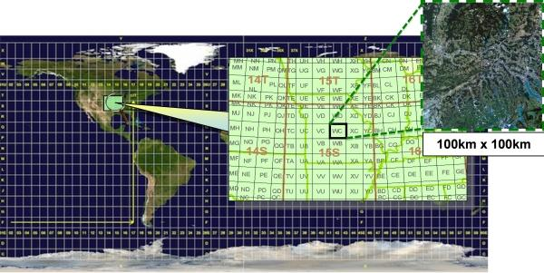
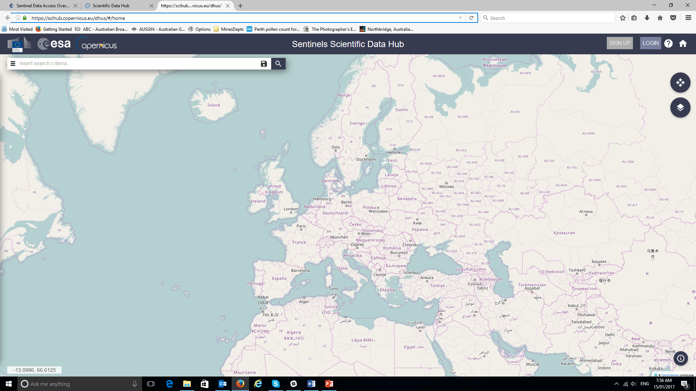

===========================
European Space Agency (ESA)
===========================

ESA has launched a number of satellites recently in their Sentinel series to observe the land and ocean areas for climate and monitoring purposes (see `this site <https://sentinel.esa.int/web/sentinel/home>`_). For geological work, the author has found the Sentinel 2 data is most useful. The Sentinel 2 mission monitors variability in land surface conditions, and its wide swath width and high revisit time (5 days) will support monitoring of changes to vegetation within the growing season. The coverage limits are from between latitudes 56° south and 84° north (ESA).

Currently the best way to select and download the Sentinel data is via the `ESA Copernicus Open Data portal <https://dataspace.copernicus.eu>`_. Register for a free login and password at the portal.

The following description is taken from the `ESA Sentinel website <https://sentinels.copernicus.eu/web/sentinel/sentinel-data-access/sentinel-products/sentinel-2-data-products/collection-1-level-1c>`_.

.. list-table:: Sentinel-2 products available for users are listed in table below.
   :widths: 15 35 30 20
   :header-rows: 1
   :class: tight-table

   * - Name
     - High-level Description
     - Production & Distribution
     - Data Volume
   * - Level-1C
     - Top-of-atmosphere reflectances in cartographic geometry
     - Systematic generation and on-line distribution
     - 600 MB (each 100x100 km2)
   * - Level-2A
     - Bottom-of-atmosphere reflectance in cartographic geometry
     - Systematic generation and on-line distribution and generation on user side (using Sentinel-2 Toolbox)
     - 800 MB (each 100x100 km2)

*"L1C Products are a compilation of elementary granules of fixed size, within a single orbit. A granule is the minimum indivisible partition of a product (containing all possible spectral bands).*

*For Level-1C and Level-2A, the granules, also called tiles, are 100x100km2 ortho-images in UTM/WGS84 projection. The UTM (Universal Transverse Mercator) system divides the Earth's surface into 60 zones. Each UTM zone has a vertical width of 6° of longitude and horizontal width of 8° of latitude. (see Figure 1). Tiles are approximately 600 MB in size. Tiles can be fully or partially covered by image data. Partially covered tiles correspond to those at the edge of the swath.*

*The continuous acquisition of Sentinel-2 image data in a given MSI mode is called a "datatake". The maximum length of an imaging datatake is 15,000 km (e.g. continuous observation from northern Russia to southern Africa). All products contain granules/tiles from a single datatake. A datatake is presented inside a product as a set of one or more datastrips (corresponding to acquisition segments downlinked to different ground stations).”*

  Level-1C product tiling

The Sentinel 2 series A and B satellites are of relevance to geology as they have a high spatial resolution and 12 bands of spectral data. The multispectral imager (MSI) covers 13 spectral bands (443 nm-2190 nm) with a swath width of 290 km and spatial resolutions of 10 m (4 visible and near-infrared bands), 20 m (6 red-edge/shortwave-infrared bands) and 60 m (3 atmospheric correction bands). The Sentinel 2 satellites main applications are in monitoring agriculture, forests, land-use change, land-cover change; mapping biophysical variables such as leaf chlorophyll content, leaf water content, leaf area index; monitoring coastal and inland waters; risk mapping and disaster mapping.

.. csv-table:: Spectral bands for the SENTINEL-2 sensor
   :header: Band number, Central wavelength (nm), Bandwidth (nm), Spatial resolution (m)

    1,443,20,60
    2,490,65,10
    3,560,35,10
    4,665,30,10
    5,705,15,20
    6,740,15,20
    7,783,20,20
    8,842,115,10
    8a,865,20,20
    9,945,20,60
    10,1380,30,60
    11,1610,90,20
    12,2190,180,20

The table below compares Sentinel 2 with other commonly used satellite sensors.

.. csv-table::
   :header: Common Name, Band Range (um), Landsat 5, Landsat 7, Landsat 8, Sentinel 2, MODIS

    Coastal,0.40 - 0.45,,,1,1,
    Blue,0.45 - 0.5,1,1,2,2,3
    Green,0.5 - 0.6,2,2,3,3,4
    Red,0.6 - 0.7,3,3,4,4,1
    Pan,0.5 - 0.7,,8,8,,
    NIR,0.77 - 1.00,4,4,5,8,2
    Cirrus,1.35 - 1.40,,,9,10,26
    SWIR16,1.55 - 1.75,5,5,6,11,6
    SWIR22,2.1 - 2.3,7,7,7,12,7
    LWIR,10.5 - 12.5,6,6,"10,11",,"31,32"

The Sentinel data can also be accessed via the Sentinel portal after registration (Sign Up button), see `this link <https://dataspace.copernicus.eu>`_.

After logging on to the portal, scroll to your area of interest and highlight a rectangle for your data search. This method of data selection is less intuitive than the USGS EarthExplorer data access and I would use a Sentinel 2 tile id to zoom to the area of interest.

A Sentinel tile index covering the world can be downloaded as a shapefile from the ESA website.

Sentinel 2 data can also be downloaded using the QGIS plug-in “Semi-Automatic Classification” which is discussed below.

Note that radar data is now available from the Sentinel 1 mission.
