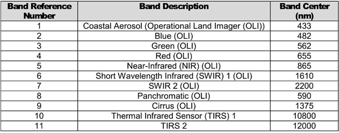

============
Landsat Data
============

Landsat 8 data is collected over 11 bands as illustrated below.

Landsat 8 band combinations are usually bands 4, 3 and 2 in the R, G and B channels for an aerial photo type image, whereas the combination of bands 6, 4 and 2 typically enhances the geology. Band 8 is used to pan-sharpen the 30 m images to 15 m resolution. The SCP plug-in will automatically pan-sharpen the RGB images if this option is selected.

.. list-table:: A recent article by Ito et al (2022) uses a series of indices to analyse the geology in Landsat scenes as follows;
   :widths: 15 35 15
   :header-rows: 1
   :class: tight-table

   * - Index Number
     - Index Name
     - Formula
   * - 1
     - Ferric Iron "redness"
     - 4/2
   * - 2
     - Ferric Iron 2
     - (4/2)*((4+6)/5)
   * - 3
     - Ferrous iron, coarse grained ferric iron
     - (3+6)/(4+5)
   * - 4
     - Clay, sulphate, mica, marble
     - (6/7)/(5/4)
   * - 5
     - Iron sulphate
     - (2/1)-(5/4)
