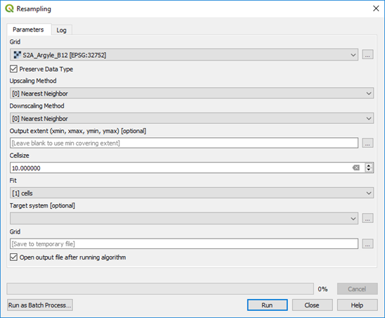
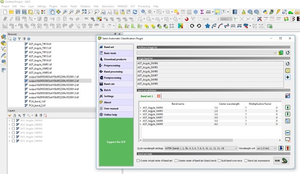
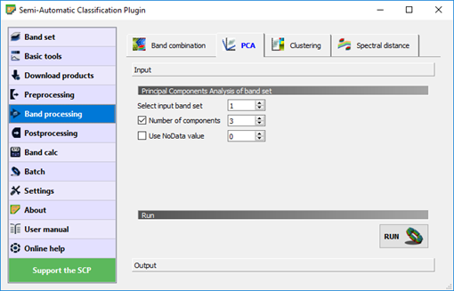

===================================
Principal Components Analysis (PCA)
===================================

Principal Components Analysis (PCA) can be undertaken using the Semi-Automatic Classification plugin or via the `Orfeo Tool Box <https://www.orfeo-toolbox.org/CookBook/QGISInterface.html>`_. The input files for the PCA analysis require they have the same pixel size and may require resampling if necessary (see Processing Toolbox > SAGA > Raster Tools > Resampling). The easiest way to ensure a common pixel size is to create a multiband raster using the Build Virtual Raster and selecting the “Highest” resolution option.

If you need to resample the raster to a different cell/pixel size, ensure you check the cell size and “Fit” to cell, otherwise it will offset the resulting image.

In the SCP plugin, create a Band Set using the Band Set tab. Press refresh to show what bands are available (in the Layers panel) then select the layers to be used for the band set - highlight the required bands, then click the plus symbol “Add band to band set”. This set of bands will be used in the PCA analysis.

Click on the Band Processing tab and select PCA. Check that the input band set is correct, select 3 components (required for an RGB colour image) and press Run. Select the target directory for the results to be saved. Note in the image above I have used the SWIR ASTER bands for the PCA analysis.

This process will produce three PCA images, PCA1, PCA2 and PCA3. Use the Virtual Raster Builder plugin to produce the RGB image (as above).
