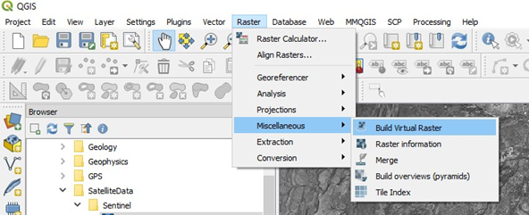
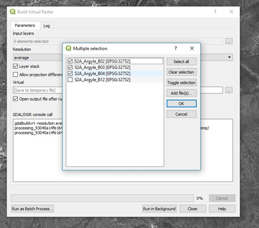
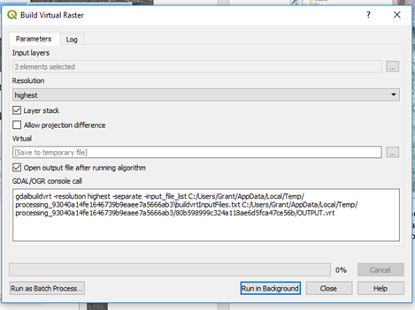
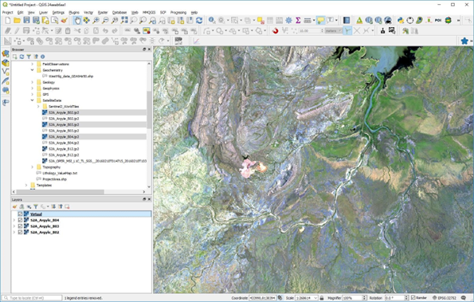
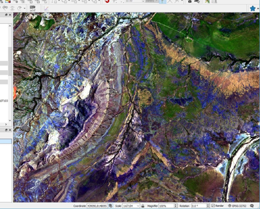
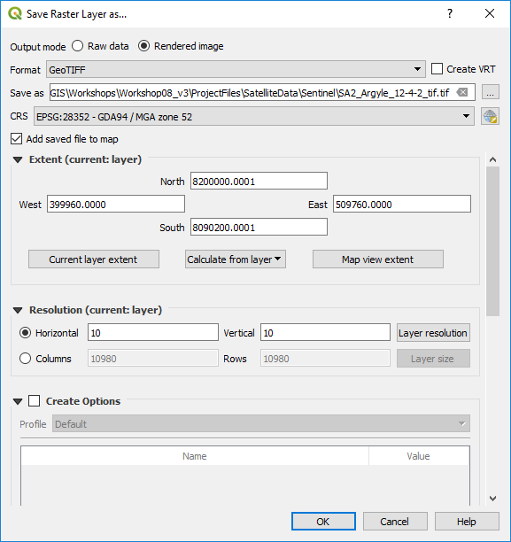

===================
Creating RGB Images
===================

There are two methods available to create a coloured image (“rgb”) of remote sensing or any other 3 band data set. We can use the Raster > Miscellaneous > Build Virtual Raster option or the “Virtual Raster Builder” plugin.

The Raster option is shown below.

The Build Virtual Raster window will be displayed. Select the input layers as the ones to use for the RGB composite. Ensure you have the files in the correct order as it assigns the red channel to the top image, green to the middle image and blue to the lower image in the selection panel.

Select the “Highest” resolution to ensure you obtain the highest resolution possible and is similar to “pansharpening” where the larger pixels will be resampled to match the smaller pixels. Press “Run in Background” and the composite colour image will be produced as a virtual image.

To save this file permanently, you need to right-click on the “Virtual” file name and save as a “Rendered” RGB image and any chosen file format, usually GeoTiff.

To adjust the colour stretch, zoom into a part of the image where you want to see more detail and then use the Layer panel to right click on the RGB layer and select “Stretch using current extent”. This can be done multiple times until you get the desired result (see below for example). Alternatively, you can activate the “Raster Toolbar” and use the toolbar to adjust the colour stretch.

The “Virtual” RGB image is currently only a temporary file. To create a permanent image, right click on the image layer in the Layers panel and select “Save As” Select the “Rendered Image” option, click the “Browse” and select the folder and required file name. Change the coordinate system if required. When all is OK, click OK. It may take some time to create the tiff file depending upon the size of the image and the speed of your computer.

The resulting RGB image can be saved via the Save Raster layer option.

Note there are options for saving as a geopackage or GeoTiff file and modifying the output projection GeoPackage files are much more compact (smaller) than equivalent GeoTiff files.

To merge adjacent satellite images/bands, initially try the Raster > Miscellaneous > Build Virtual Raster option. If this is unsuccessful, or creates large blanks between images, try the using the Processing Toolbox > SAGA > Raster tools > Mosaic raster layers. Option settings that have worked in merging adjacent ASTER scenes are:
| Interpolation - “4 B-Spline”
| Overlapping areas - “6 feathering”
| Blending distance - “1000”
| Match - “regression”
| Cell size - “15” (or 30 m, 60 m, 90 m - to match the relevant pixel sizes for the images being merged)
| Fit - “Cells”
| and save to a file. All other setting as default.

If you have problems merging adjacent satellite images where you get edge effects between adjacent scenes, try downloading and installing `SAGA <https://saga-gis.sourceforge.io/en/index.html>`_. This a powerful and free GIS analysis program and has a good help file. The mosaicking option is found in the Geoprocessing > Grid > Grid System > Mosaicking menu item. Use the Match option “match histograms of overlapping area”.
