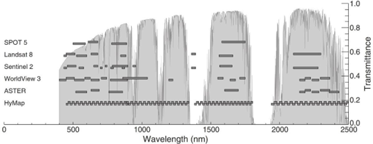
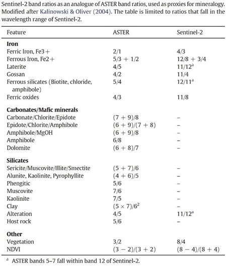

===============
Sentinel 2 Data
===============

The Sentinel 2 satellites are designed for earth observation and the figure below illustrates the comparison with the other satellite data bands (from van der Meer et al 2014). The Sentinel satellite constellation has been launched by the European Space Agency (ESA) and the derived data is available free of charge. See `ESA website <https://sentinel.esa.int/web/sentinel/home>`_ for more detail on the available data and data access. You need to register (free) on the Sentinel web site to be able to download the Sentinel data.

When using Sentinel 2 data, it is recommended to use bands 4, 3 and 2 (for RGB) for the natural aerial photo type image and a combination of bands 12 or 11, 4 and 2 (for RGB) which can enhance the geology in a scene. Users should experiment with various band ratios to find which is the most suitable for their application.

.. list-table:: The following list of recommended band combinations is from the Sentinel education `web page <https://www.sentinel-hub.com/explore/education/>`_
   :widths: 30 30
   :header-rows: 1
   :class: tight-table

   * - Index Name
     - Formula
   * - Natural Colour
     - B4 (red), B3 (green), B2 (blue)
   * - Colour Infrared (vegetation)
     - B8, B4, B3
   * - False Colour (Urban)
     - B12, B11, B4
   * - Agriculture
     - B11, B8, B2
   * - Vegetation Index
     - (B8 - B4)/(B8 + B4)
   * - Moisture Index
     - (B8A - B11)/(B8A + B11)
   * - Geology
     - B12, B4, B2
   * - Bathymetric
     - B4, B3, B1
   * - Atmospheric Penetration
     - B12, B11, B8A
   * - SWIR
     - B12, B8A, B4
   * - NDWI
     - (B3 - B8)/(B3 + B8)
   * - SWIR-2
     - B2, B11, B12

Another useful band combination for a “Regolith Ratio” image is 11/12 (red), 8A/12 (green) and 8A/3 (blue) (from Mark Arundel).

The figure below from van der Meer et al 2014 compares ASTER ratio mineral mapping to the equivalent bands in the Sentinel 2 data.

