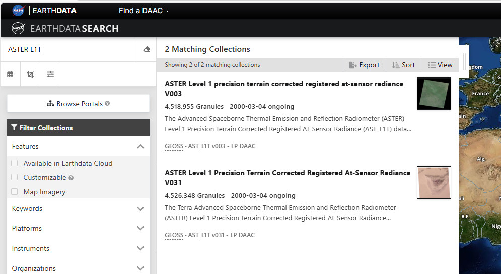

======================================
United States Geological Survey (USGS)
======================================

The USGS holds an enormous amount of free data, most of which is accessible via its `EarthData portal (https://urs.earthdata.nasa.gov/home)`. To download the data, you are required to register (free) and select a username and password, and create a user profile. You can browse data but you need to have registered and have created a profile in the EarthData portal to be able to download data. Note that ASTER data is no longer available on the EarthExplorer portal.

ASTER and Landsat data are two of the remote sensing datasets available from the USGS. Digital elevation, radar and Lidar data are also available from the USGS. Note that Sentinel 2 data is not available from the EarthData portal.

Use the Register button to create a free account or log in if you have an existing EarthData account. Logging in allows you to download datasets.

Enter the collection you wish to search criteria by entering it into the top left hand corner.

To search for ASTER data, use the term "ASTER L1T".

Add a spatial search by selecting the spatial search tools. This can be a Google Earth kml file or a zipped shape file. The search can be further refined by day/night and by time period. Note that the SWIR sensor failed about early April 2008 and therefore if you are doing mineral mapping then set your latest time to 1st April 2008.
To search for ASTER data, use the term "ASTER L1T".

If there is data available from your search request, you can then examine the thumbnails of the scenes and select which dataset is the best one for your purposes. The footprint icon will show the area covered by the scene. Click on the green plus button to add the scene to your downloads list. When you have completed your selection, click on Download. And again on the next screen to download the data. Note there will be three options per scene - the data in the hdf file and one image tif file for each of the visible and thermal preview files.

