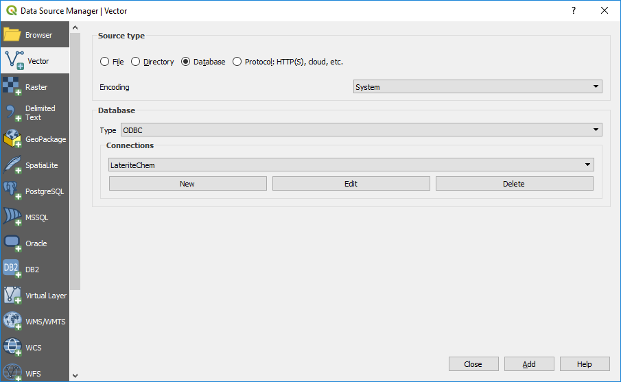

================
Access Databases
================

Connecting to an Access database requires some additional steps than required for the open source database programs.

Open the 64-bit ODBC admin window (via the Windows search box) and add another “Access 64-bit line”, select the database name and location in the User DSN tab - e.g. “LateriteChem”.

In the Open Data Source Manager, select the Add Vector option, and type of Database. Connect to the database and Add.

The next window will display the tables available for import.

If the table has spatial data, e.g. coordinates, then after import, use the Processing Toolbox > Algorithms > Vector Creation > Create Points Layer from Table, and select the field for the coordinates and the applicable Coordinate Reference System.
