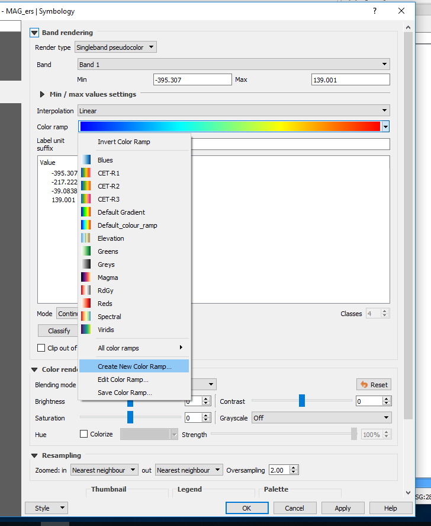
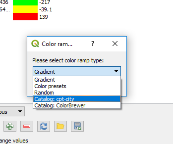
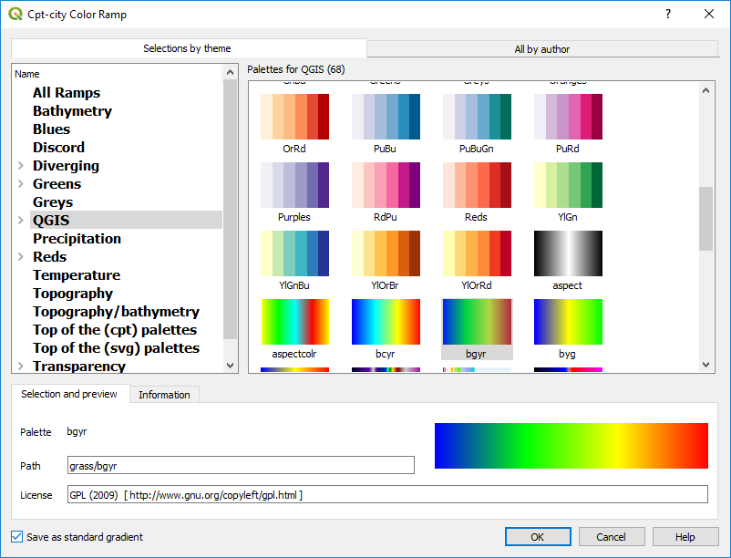
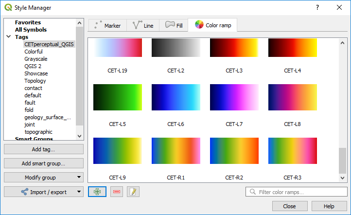

============
Colour Ramps
============

To add additional colour ramps to the default option use the “Create New Colour Ramp” from the drop down box to the right of the Color Ramp selection box,. The preset colour ramps are shown in the “Color Ramp” dialog box and I recommend the Catalog: cpt-city option which will display the next dialog box.

There are many different groups to select from, but I prefer the QGIS tab, and the continuous colour bands, e.g. “bgyr”.

New colour ramps can also be imported via the Style Manager dialog box.

The Centre for Exploration Targeting (CET) in Perth have developed colour ramps that are better for visual perception (see `this link <https://peterkovesi.com/projects/colourmaps/>`_). They are available in a QGIS xml format that can be imported via the Style Manager. These styles can then be access as favourites. My preference for data grids such as magnetics is to use the CET-R1 colour ramp.

