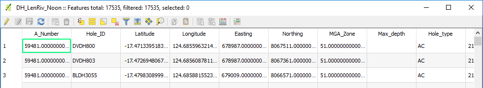
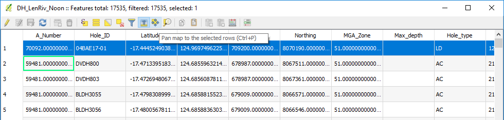

==============
Data Searching
==============

When searching large datasets, a number of options can be used. Spatial searches can be done in your map window but text searches are best done via the Expression form.

Highlight the layer in the Layers panel, bring up its attribute table and click on the “Select Features Using an Expression” button.

This will bring up the expression editor window. Click on the central panel to select the field to search in, then press “all unique” in the lower right hand side of the dialog box to show all the entries in this field. You can filter by entering values into the “Values” window. Double click the field name to enter it into the left hand panel. Use the function button to add a function, e.g. “=” and then double click on the value to search for in the right hand panel. Hit select to run the query.

Go to the attribute table and select the “Move selection to top” of the table. This may take a little while in large datasets but it will display the selected record(s) at the top of the table and highlight them.

To show these on the map, select the “Pan map to selected rows” icon and the map will pan to the area of the selected features.

