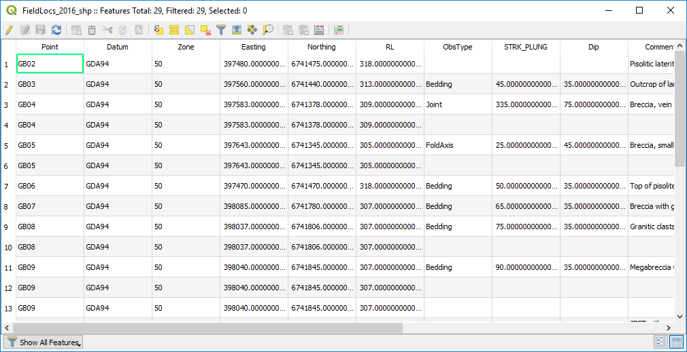
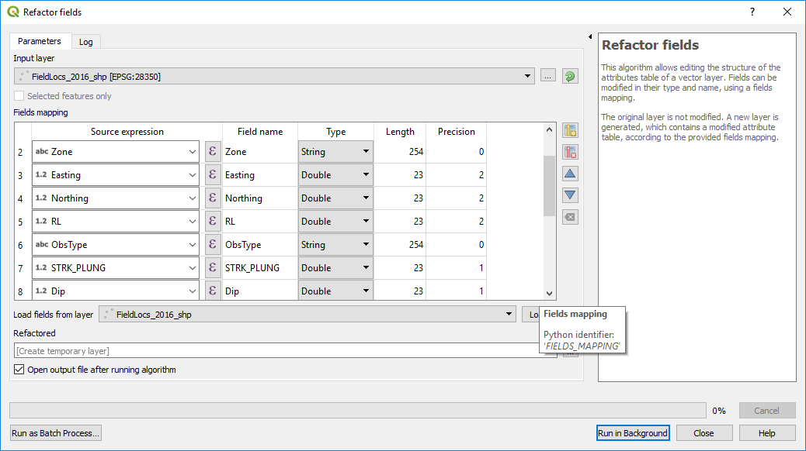

===============
Refactor Fields
===============

The Refactor Fields algorithm allow the modification of a table's attributes. Be careful using this!

Note the fields with way too many decimals. These can be fixed using the Processing Toolbox > Vector General > Refactor Fields.

Field names, types and other info can be changed in this window.
