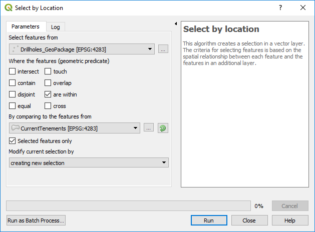

=================================
Selecting Drill Holes by Tenement
=================================

To select drill holes in a tenement, simply highlight the drill hole layer in the Layers panel, then in the top menu bar choose, select Features by polygon, then right click on the polygon you want to use to select the drill holes, the select layer (e.g. tenements layer) will be listed, just select that layer and the holes will selected for that tenement. Note this may not worked with layers in different projections.

The other method that can be used is the Processing Toolbox > Vector Selection > Select by Location algorithm.

If you hold the "Alt" key while making a selection QGIS, it switches from an "intersects" type selection to a "contains" selection mode. (This also works while holding the shift modifier to add to a selection, or ctrl to subtract from a selection!).
